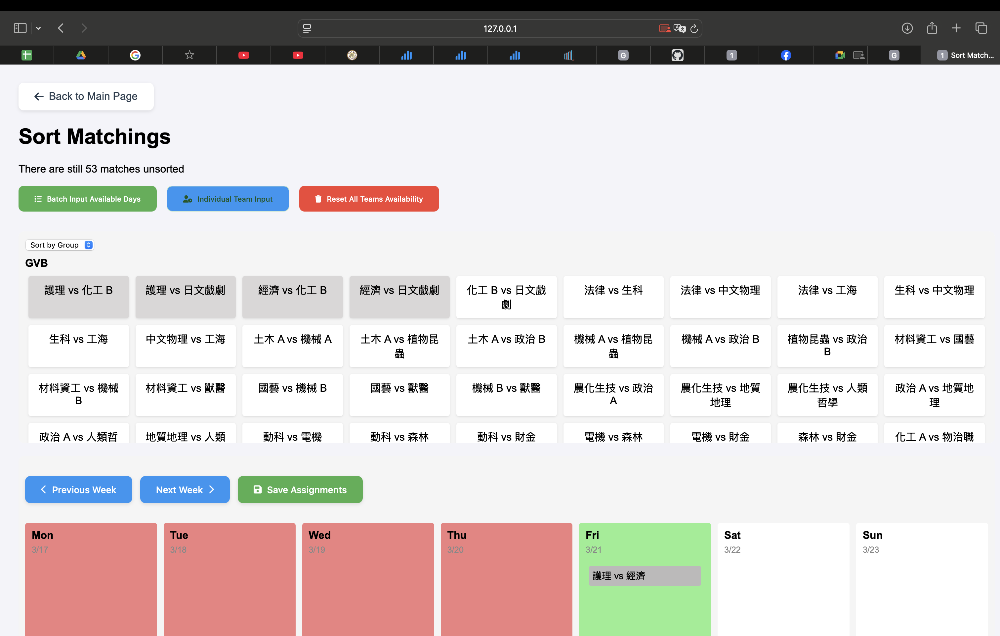
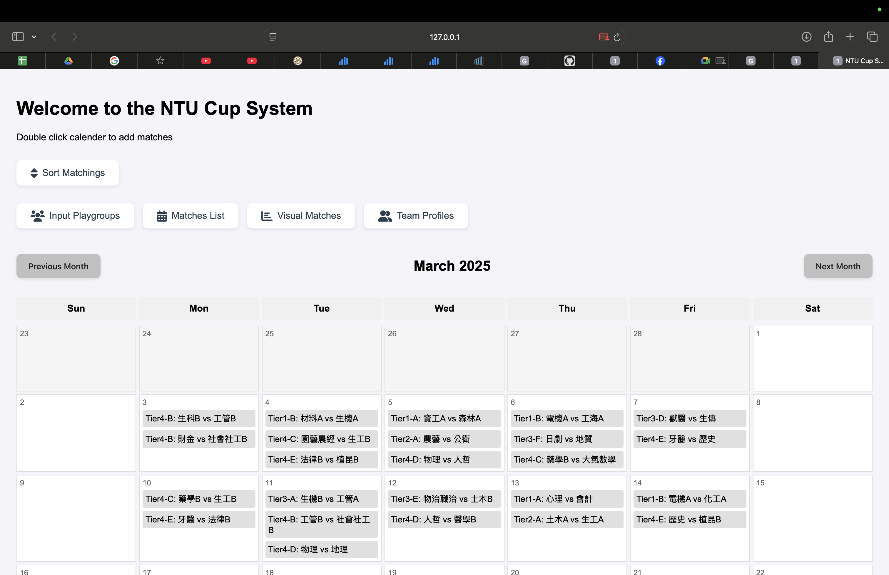
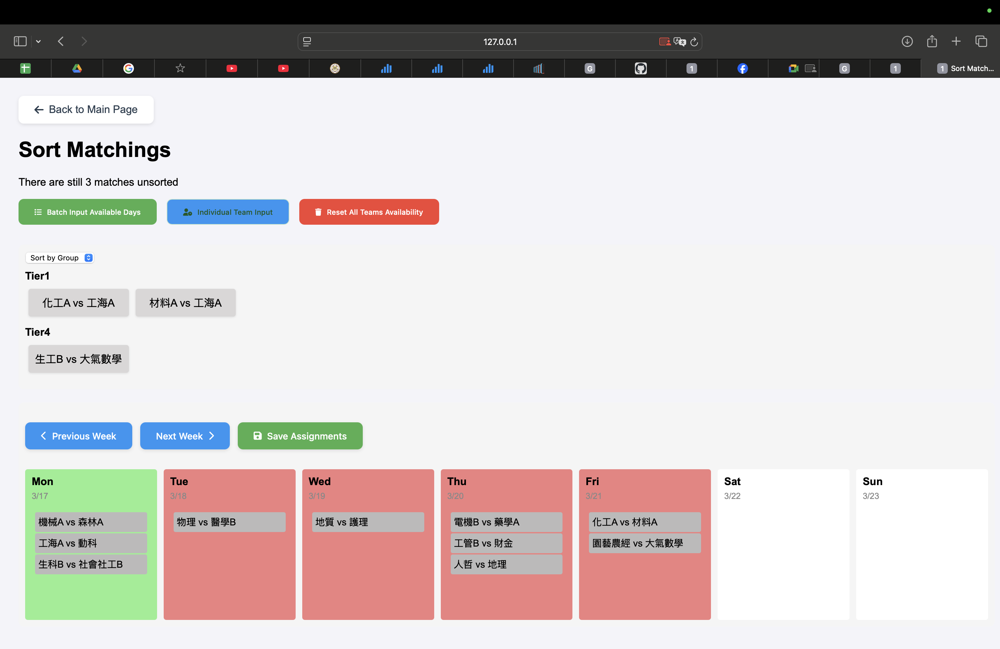

# Week3 Report - Group 1

## Work Item

This week we planned what our final projects will be: **A Global Volleyball Court Reservation Website**. \
First, we drew what the structure of our project would look like in [**_WebOutline.pdf_**](https://github.com/YuXiangLo/NTUWPA2024/blob/main/HW_Report/Week03/WebOutline.pdf) \
Then, we planned what the data storage in SQL would be like in the future. See [**_Data Storage Structure.txt_**](https://github.com/YuXiangLo/NTUWPA2024/blob/main/HW_Report/Week03/Data%20Storage%20Structure.txt) \
The current Prototype is shown [**_here_**](https://github.com/YuXiangLo/NTUWPA2024/tree/main/HW_Report/Week03/create%20tournament) \
You can find demo video in [**_here_**](https://github.com/YuXiangLo/NTUWPA2024/tree/main/HW_Report/Week03/demo/week03_demo.mov)

## Screenshots





## Practiced Class Topics
- **HTML**
- **CSS**
- **JavaScript**

## Additional Programming Techniques Explored

### React.js Framework Practice
We chose React for its convenience in **Object-Oriented Programming (OOP) development** and **various plugin support**.

### Node Version Manager (NVM)
To manage Node.js versions efficiently, we used **NVM**:
```
nvm install 22.13.1
nvm use 22.13.1
node -v  # Output: v22.13.1
```

## Team Member Work Items and Contributions

| Name   | Work Item                         | Contribution           |
|--------|-----------------------------------|:----------------------:|
| 黃靖家 | Backend Planning                  | <center>1 / 4</center> |
| 楊盛評 | SQL Planning and Design           | <center>1 / 4</center> |
| 羅煜翔 | Google Maps API Research          | <center>1 / 4</center> |
| 郭恩偕 | Frontend Design, Website Planning | <center>1 / 4</center> |


