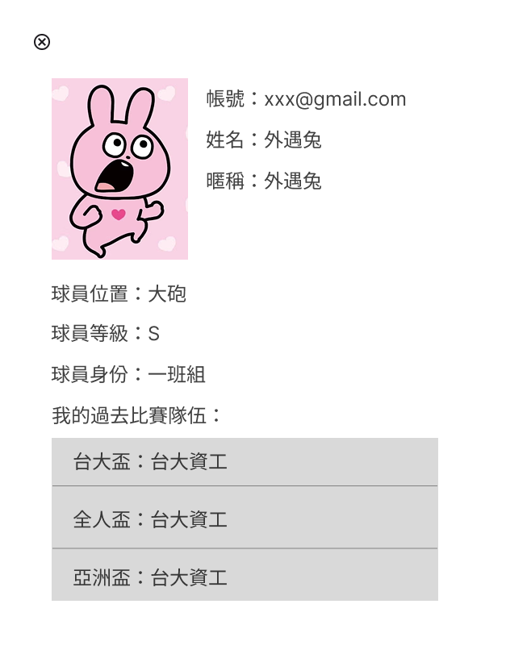

# Week5 Report - Group 1

## Work Item

* Planned frontend structure using Figma
* Practiced React with LeafLet API

## Screenshots

  

    
  

  

    
  

  

    
  

  

    
  

  

    
  

  

    
  

## Practiced Class Topics

* [React](https://react.dev/): a free and open-source front-end JavaScript library that aims to make building user interfaces based on components more "seamless".

## Additional Programming Techniques Explored

* [Figma](https://www.figma.com/): a collaborative web application for interface design.
* [Leaflet](https://www.figma.com/): a JavaScript library used to build web mapping applications.

## Team Member Work Items and Contributions

| Name  | Work Item                                          | Contribution           |
|-------|----------------------------------------------------|:----------------------:|
| 黃靖家 | Figma Planning                                     | 
1 / 4
 |
| 楊盛評 | Backend Sign in/up and Database Planning (Ongoing) | 
1 / 4
 |
| 羅煜翔 | React Leaflet API Practice                         | 
1 / 4
 |
| 郭恩偕 | Frontend Development (Ongoing)                     | 
1 / 4
 |

