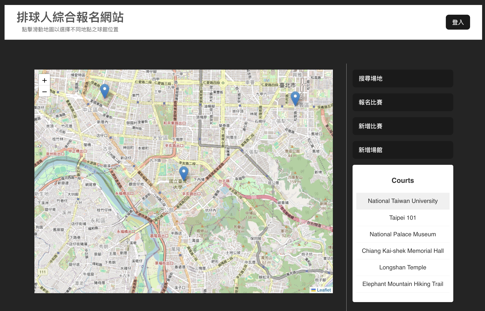
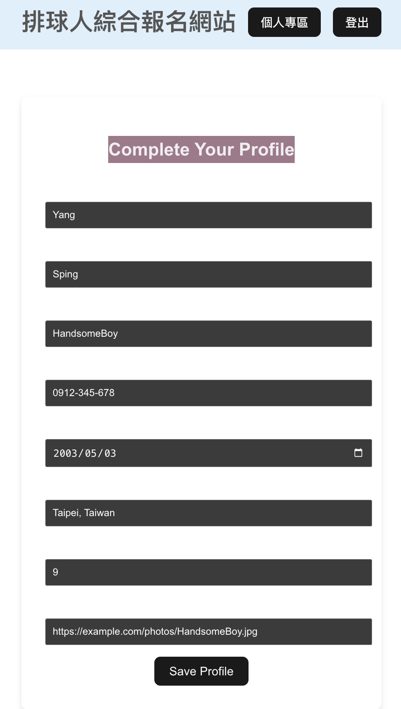
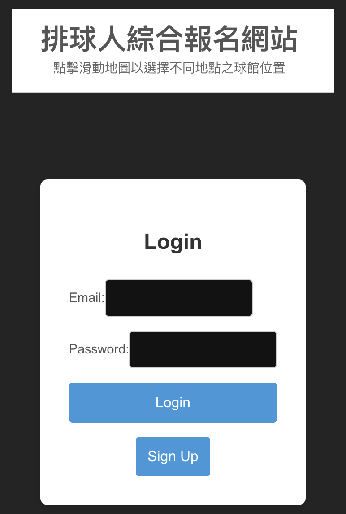
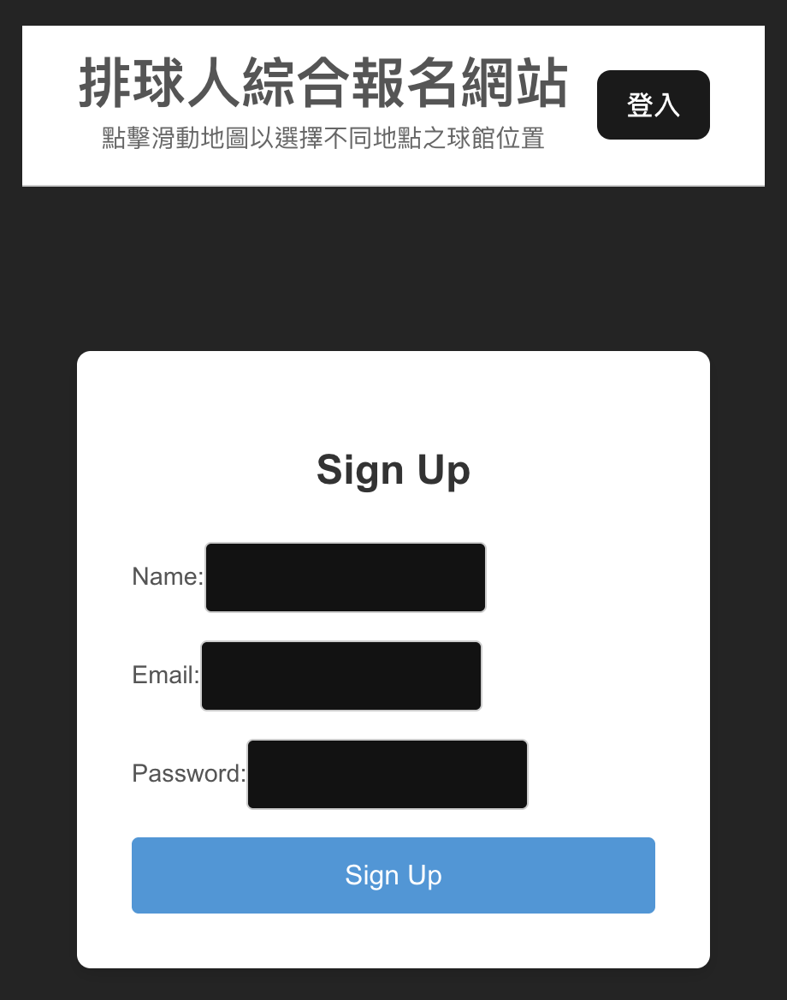
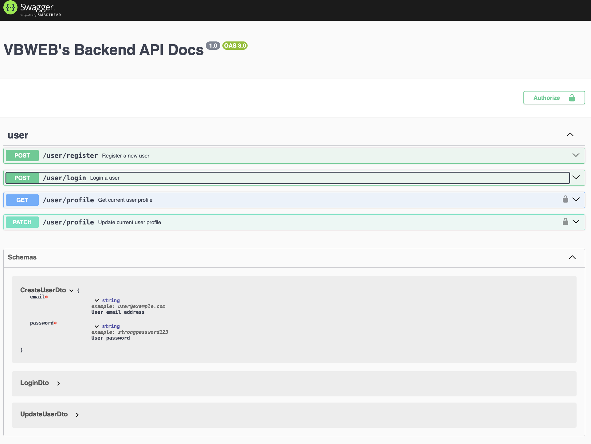
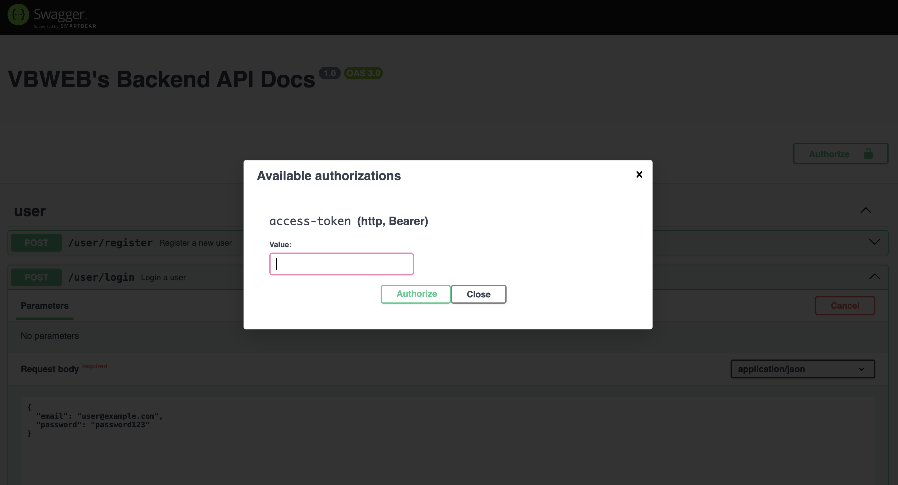
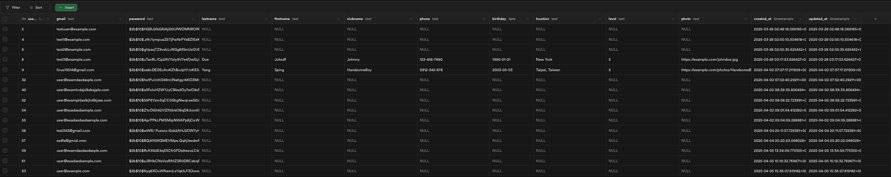

# 🚀 Week 7 Report - Group 1

## 📚 Table of Contents
- [📋 Work Items](#-work-items)
- [🖼️ Demo Screenshots](#-demo-screenshots)
- [🎯 Topics Practiced](#-topics-practiced)
- [🛠️ Additional Techniques Explored](#-additional-techniques-explored)
- [👨‍💻 Team Member Contributions](#-team-member-contributions)

---

## 📋 Work Items

### 🖥️ Frontend
- Built separate pages: Login, Register, Search Venue, Home, and more.
- Stored refresh token in cookies and access token in memory.

### 🔧 Backend
- Developed a backend service using **Nest.js** with **Supabase** support.
- Completed APIs:
  - `POST /auth/register` — Register a new user
  - `POST /auth/login` — User login
  - `GET /user/profile` — Fetch user profile
  - `PATCH /user/profile` — Update user profile

**Key Features:**
- **Register:** Passwords are hashed using `bcryptjs`.
- **Login:** Handle access and refresh JWT tokens for security and session control.
- **Profile:** Data interactions via Supabase (`/VBWEB/backend/src/user/supabase.service.ts`).

### 🐳 Docker
- Dockerfiles created for both **frontend** and **backend**.

#### 🛠️ Build and Run

```bash
# To get the image, you can build one yourself or use our built
docker pull yuxiang0503/frontend-app
docker pull yuxiang0503/backend-app

# Frontend: Build and run 
cd VBWEB/frontend/
docker build -t frontend-app .
docker run -d -p 5173:5173 --name frontend-container frontend-app

# Backend: Build and run
cd VBWEB/backend/
# Make sure .env is present before building
docker build -t backend-app .
docker run -d -p 3000:3000 --name backend-container backend-app
```

---

## 🖼️ Demo Screenshots

### Frontend
|        Home Page         |       Profile Page      |
|:------------------------:|:------------------------:|
|  |  |

|        Login Page        |       Register Page      |
|:------------------------:|:------------------------:|
|  |  |

### Backend
|        Swagger UI        |     JWT Access Token     |
|:------------------------:|:------------------------:|
|  |  |

| Supabase DB              |
|--------------------------|
|  |

---

## 🎯 Topics Practiced
- **MVC Framework**: Nest.js
- **Containerization**: Docker
- **Frontend Development**: React

---

## 🛠️ Additional Techniques Explored

### 🔥 Nest.js
Chose **Nest.js** for its clean architecture, modularity, and scalability following the MVC pattern.

### 🛡️ Supabase
Leveraged **Supabase** for easy database management (PostgreSQL) with additional built-in features like authentication, firewall, and API generation.

---

## 👨‍💻 Team Member Contributions

| Name  | Work Item                         | Contribution |
|-------|-----------------------------------|:------------:|
| 黃靖家 | Docker, frontend dev              | 1/4 |
| 楊盛評 | Docker, backend dev               | 1/4 |
| 羅煜翔 | Docker, backend dev               | 1/4 |
| 郭恩偕 | Docker, frontend dev              | 1/4 |

---

