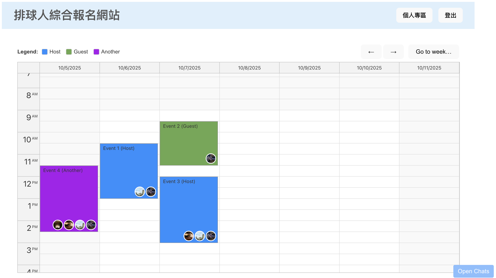
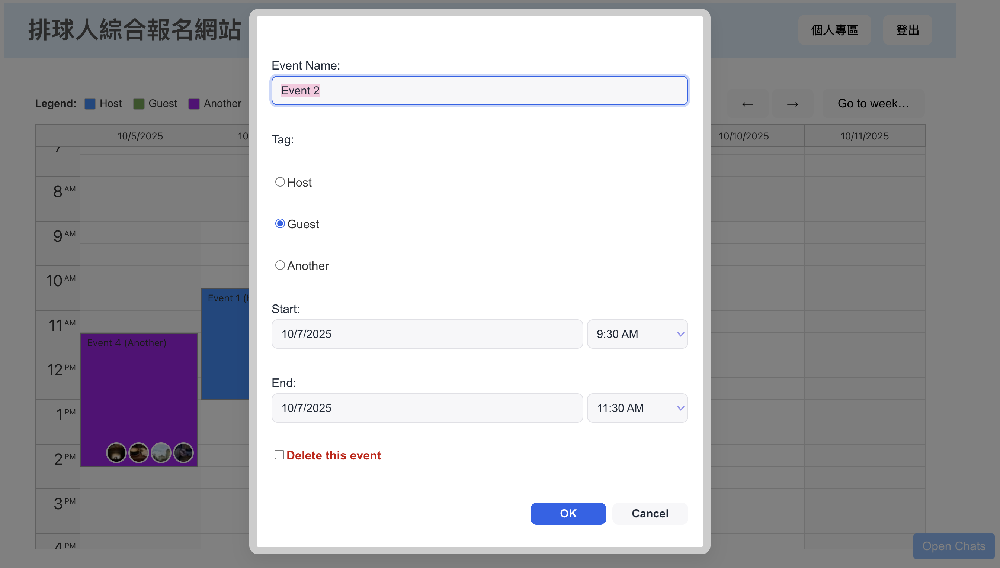

# 🚀 Week 7 Report - Group 1

## 📚 Table of Contents

- [🚀 Week 7 Report - Group 1](#-week-7-report---group-1)
  - [📚 Table of Contents](#-table-of-contents)
  - [⚙️ Installation](#️-installation)
  - [📋 Work Items](#-work-items)
    - [🖥️ Frontend](#️-frontend)
    - [🔧 Backend](#-backend)
  - [🖼️ Demo Screenshots](#️-demo-screenshots)
    - [Frontend](#frontend)
    - [Backend](#backend)
  - [🎯 Topics Practiced](#-topics-practiced)
  - [🛠️ Additional Techniques Explored](#️-additional-techniques-explored)
    - [🔥 Nest.js](#-nestjs)
    - [🛡️ Supabase](#️-supabase)
  - [🔌 API Specification](#-api-specification)
    - [Base URL](#base-url)
    - [1. Authentication](#1-authentication)
    - [2. User](#2-user)
    - [3. Venue](#3-venue)
    - [4. Court](#4-court)
    - [5. Reservation](#5-reservation)
    - [6. Chat](#6-chat)
    - [7. Friends](#7-friends)
  - [👨‍💻 Team Member Contributions](#-team-member-contributions)

---

## ⚙️ Installation

1. **Clone the repository**

   ```bash
   git clone https://github.com/your-org/volleyball-booking.git
   cd volleyball-booking
   ```
2. **Environment variables**
   Copy and set up your `.env` files for both frontend and backend:

   * `BACKEND_URL` (e.g. `http://localhost:3000`)
   * `SUPABASE_URL` & `SUPABASE_ANON_KEY`
   * JWT secrets: `JWT_ACCESS_SECRET`, `JWT_REFRESH_SECRET`
3. **Backend setup**

   ```bash
   cd backend
   npm install
   npm run start:dev
   ```
4. **Frontend setup**

   ```bash
   cd ../frontend
   npm install
   npm run dev
   ```
5. **Access**

   * Frontend: `http://localhost:5173`
   * Swagger (Backend): `http://localhost:3000/api`

---

## 📋 Work Items

### 🖥️ Frontend

* Built `components/Calendar.jsx`, you can try it in `localhost:5173/test`
* Built chat widget so you can add and text friend there
* Upgraded landmark list to allow locating current position
* Built profile page and connected to backend API

### 🔧 Backend

* Set up **Nest.js** modules, controllers, and services
* Integrated **Supabase** PostgreSQL schema and API endpoints
* Implemented authentication (`/auth`), user profile (`/user`), venue (`/venues`), court (`/courts`), reservation (`/reserve`), chat (`/chats`), and friends (`/friends`) routes
* Configured JWT-based access and refresh token flow
* Added **Swagger** documentation for all endpoints

**Key Features:**

* Secure JWT authentication and token management
* Full CRUD for user profiles and media uploads
* Venue and court discovery with geolocation support
* Reservation conflict handling and timeslot management
* Real-time messaging via WebSocket for private and group chats

---

## 🖼️ Demo Screenshots

### Frontend

|         Home Page        |       Profile Page       |
| :----------------------: | :----------------------: |
|  |  |

|        Login Page        |       Register Page      |
| :----------------------: | :----------------------: |
|  |  |

### Backend

|        Swagger UI        |     JWT Access Token     |
| :----------------------: | :----------------------: |
|  |  |

|  Supabase DB Screenshot  |
| :----------------------: |
|  |

---

## 🎯 Topics Practiced

* **AJAX + WebSocket**: Chat Room

---

## 🛠️ Additional Techniques Explored

### 🔥 Nest.js

Chose **Nest.js** for its clean architecture, modularity, and scalability following the MVC pattern.

### 🛡️ Supabase

Leveraged **Supabase** for easy database management (PostgreSQL) with additional built-in features like authentication, firewall, and API generation.

---

## 🔌 API Specification

### Base URL

```
https://api.example.com
```

*All protected endpoints require:*

```
Authorization: Bearer <access_token>
```

### 1. Authentication

| Method | Path                  | Description               |
| ------ | --------------------- | ------------------------- |
| POST   | `/auth/register`      | Register a new user       |
| POST   | `/auth/login`         | Log in and receive tokens |
| POST   | `/auth/refresh-token` | Refresh access token      |

### 2. User

| Method | Path            | Description                   |
| ------ | --------------- | ----------------------------- |
| GET    | `/user/profile` | Get current user’s profile    |
| PATCH  | `/user/profile` | Update current user’s profile |
| POST   | `/user/photo`   | Upload or update user photo   |

### 3. Venue

| Method | Path           | Description                  |
| ------ | -------------- | ---------------------------- |
| GET    | `/venues`      | List all venues              |
| GET    | `/venues/{id}` | Get details for venue `{id}` |

### 4. Court

| Method | Path                                  | Description                     |
| ------ | ------------------------------------- | ------------------------------- |
| GET    | `/courts/{court_id}`                  | Get court details               |
| GET    | `/courts/court-venue-name/{court_id}` | Get court + venue name/location |

### 5. Reservation

| Method | Path                        | Description                   |
| ------ | --------------------------- | ----------------------------- |
| POST   | `/reserve`                  | Create a new reservation      |
| GET    | `/reserve/court/{court_id}` | List reservations for a court |

### 6. Chat

| Method | Path                               | Description              |
| ------ | ---------------------------------- | ------------------------ |
| GET    | `/chats`                           | List all chats           |
| POST   | `/chats/{chatId}/read`             | Mark a chat as read      |
| GET    | `/chats/private/{friendId}`        | Open/get private chat    |
| POST   | `/chats/private/{friendId}`        | Send in private chat     |
| POST   | `/chats/group`                     | Create a new group chat  |
| POST   | `/chats/{chatId}/members/{userId}` | Add user to group        |
| POST   | `/chats/{chatId}/remove/{userId}`  | Remove user from group   |
| GET    | `/chats/{chatId}/messages`         | List messages in a chat  |
| POST   | `/chats/{chatId}/messages`         | Send message in any chat |

### 7. Friends

| Method | Path                                   | Description                                  |
| ------ | -------------------------------------- | -------------------------------------------- |
| GET    | `/friends/{userId}`                    | List friends of a user                       |
| GET    | `/friends/{userId}/requests`           | List incoming friend requests                |
| POST   | `/friends/{userId}/request`            | Send a friend request to a user              |
| PUT    | `/friends/{userId}/respond/{senderId}` | Respond to a friend request (accept/decline) |

---

## 👨‍💻 Team Member Contributions

| Name  | Work Item                         | Contribution |
|-------|-----------------------------------|:------------:|
| 黃靖家 | Full Stack DevOps                 | 1/4 |
| 楊盛評 | Full Stack DevOps                 | 1/4 |
| 羅煜翔 | Full Stack DevOps                 | 1/4 |
| 郭恩偕 | Full Stack DevOps                 | 1/4 |

---
