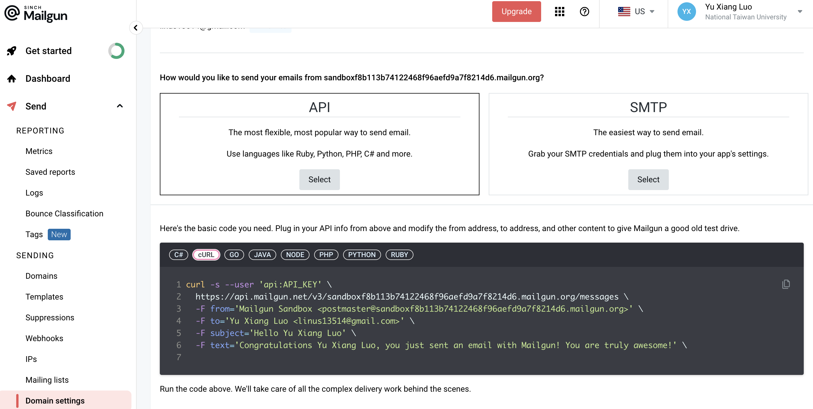

# 🚀 Week 7 Report - Group 1

## 📚 Table of Contents

- [� Week 7 Report - Group 1](#-week-7-report---group-1)
  - [📚 Table of Contents](#-table-of-contents)
  - [📋 Work Items](#-work-items)
    - [Mail Verification – Mailgun](#mail-verification--mailgun)
    - [Deploy](#deploy)
    - [🔧 Features](#-features)
  - [🖼️ Demo Screenshots](#️-demo-screenshots)
  - [🎯 Topics Practiced](#-topics-practiced)
  - [🛠️ Additional Techniques Explored](#️-additional-techniques-explored)
  - [👨‍💻 Team Member Contributions](#-team-member-contributions)

---

## 📋 Work Items


### Mail Verification – Mailgun
```shell
❯ export API_KEY=BLABLABLA # set API key

❯ SHA_256("SECRET_SALT...linus13514@gmail.com") # prepend salt for better security
  b281a9ba8f350900772c958aa3a3bdb1a95ef3d4ee556188f5e93701de4c3ce3

❯ curl -s --user "api:${API_KEY}" \
  https://api.mailgun.net/v3/sandboxf8b113b74122468f96aefd9a7f8214d6.mailgun.org/messages \
  -F from='Mailgun Sandbox <postmaster@sandboxf8b113b74122468f96aefd9a7f8214d6.mailgun.org>' \
  -F to='Yu Xiang Luo <linus13514@gmail.com>' \
  -F subject='Verify Your Email' \
  -F html='Hello Yu Xiang Luo:<br /><br />Welcome! Your verification code is b281a9ba8f350900772c958aa3a3bdb1a95ef3d4ee556188f5e93701de4c3ce3'
```

### Deploy

* **FreeDNS**: Register a _free_ subdomain [yuxiang.mooo.com](https://yuxiang.mooo.com) from [freedns.afraid.org](https://freedns.afraid.org/)
* **Caddy**:
  1. Automatic HTTPS (TLS certificates via Let’s Encrypt)
  2. Reverse proxy for routing client requests to backend servers
  3. Easy configuration with a declarative Caddyfile or JSON
  4. Built-in support for HTTP/3, caching, and logging

### 🔧 Features

1. **Support Google Login** \
- Integrate Google OAuth 2.0 for third-party authentication \
- Configure frontend and backend to handle Google login flow

2. **Renew Frontend Code Structure** \
- Refactor project directories and files for improved maintainability \
- Adopt a modular architecture separating components, features, and services

3. **Finish Venue → Reservation → Play Workflow** \
- make reservation, and initiate play session, including apply, maintain, and review requests for each instance. \
- Ensure seamless navigation and state management across the workflow.

4. **Renew frontend style (under working)** \
- Update UI/UX styling to match new design guidelines \
- Standardize component styling, typography, and frontend design patterns

---

## 🖼️ Demo Screenshots

|       Mailgun Mail       | Mailgun Official Instruction | 
|:------------------------:|:----------------------------:|
|  |      |

---

## 🎯 Topics Practiced

- Third Party API
- Mail Verification for Register
  - We use hash function with salt value to create unique token for verification

---

## 🛠️ Additional Techniques Explored


---

## 👨‍💻 Team Member Contributions

| Name  | Role              | Contribution |
|-------|-------------------|:------------:|
| 黃靖家 | Full Stack DevOps |     1/4      |
| 楊盛評 | Full Stack DevOps |     1/4      |
| 羅煜翔 | Full Stack DevOps |     1/4      |
| 郭恩偕 | Full Stack DevOps |     1/4      |
