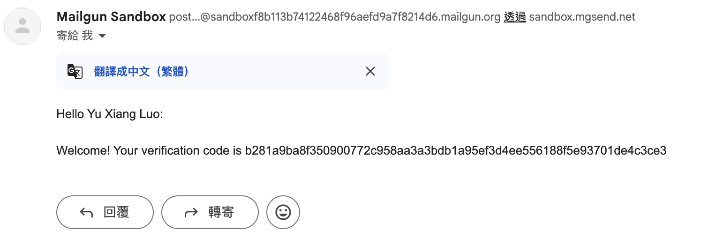
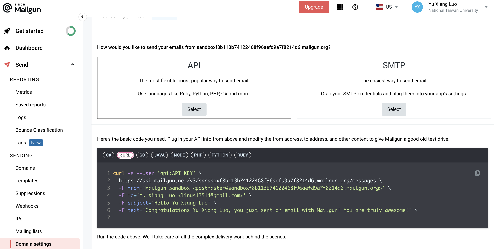

# 🚀 Week 13 Report - Group 1

## 📚 Table of Contents

- [🚀 Week 13 Report - Group 1](#-week-7-report---group-1)
  - [📚 Table of Contents](#-table-of-contents)
  - [📋 Work Items](#-work-items)
    - [📨 Mail Verification – Mailgun](#-mail-verification--mailgun)
    - [🚀 Deploy](#-deploy)
    - [🔧 Features](#-features)
    - [♻️ Refactor](#-refactor)
  - [🎯 Topics Practiced](#-topics-practiced)
  - [🛠️ Additional Techniques Explored](#-additional-techniques-explored)
  - [👨‍💻 Team Member Contributions](#-team-member-contributions)

---

## 📋 Work Items

### 📨 Mail Verification – Mailgun
```shell
# Since Mailgun free account can only send email to test account
# We would not be able to showcase until we built our own mail server
# However, we could show our experiment script for demonstration

❯ export API_KEY=BLABLABLA # set API key

❯ SHA_256("SECRET_SALT...linus13514@gmail.com") # prepend salt for better security
  b281a9ba8f350900772c958aa3a3bdb1a95ef3d4ee556188f5e93701de4c3ce3

❯ curl -s --user "api:${API_KEY}" \
  https://api.mailgun.net/v3/sandboxf8b113b74122468f96aefd9a7f8214d6.mailgun.org/messages \
  -F from='Mailgun Sandbox <postmaster@sandboxf8b113b74122468f96aefd9a7f8214d6.mailgun.org>' \
  -F to='Yu Xiang Luo <linus13514@gmail.com>' \
  -F subject='Verify Your Email' \
  -F html='Hello Yu Xiang Luo:<br /><br />Welcome! Your verification code is b281a9ba8f350900772c958aa3a3bdb1a95ef3d4ee556188f5e93701de4c3ce3'
```

|       Mailgun Mail       | Mailgun Official Instruction | 
|:------------------------:|:----------------------------:|
|  |      |

### 🚀 Deploy

- **🌐 FreeDNS**: Registered a free subdomain [yuxiang.mooo.com](https://yuxiang.mooo.com) from [freedns.afraid.org](https://freedns.afraid.org)
- **🛡️ Caddy Server**:
  1. Automatic HTTPS via Let’s Encrypt
  2. Reverse proxy support
  3. Easy configuration via Caddyfile/JSON
  4. Built-in HTTP/3, caching, logging

---

### 🔧 Features

1. **🔐 Google Login**
   - Integrated OAuth 2.0 for third-party authentication
   - Configured both frontend and backend for full login flow

2. **🏟️ Venue → Reservation → Play Workflow**
   - Users can make reservations, initiate play sessions, and review requests
   - Implemented state and navigation management across all steps

---

### ♻️ Refactor

3. **🧱 Frontend Code Structure**
   - Refactored into modular architecture: components, features, services

4. **🎨 Frontend Style Revamp (In Progress)**
   - Unified UI/UX per new design system
   - Standardized typography and design patterns

---

## 🎯 Topics Practiced

- 🔗 Third-Party API Integration
- ✉️ Mail Verification Token Generation with Salted Hashes

---

## 🛠️ Additional Techniques Explored


---

## 👨‍💻 Team Member Contributions

| Name  | Role              | Contribution |
|-------|-------------------|:------------:|
| 黃靖家 | Full Stack DevOps |     1/4      |
| 楊盛評 | Full Stack DevOps |     1/4      |
| 羅煜翔 | Full Stack DevOps |     1/4      |
| 郭恩偕 | Full Stack DevOps |     1/4      |
